# Azure DevOps Pipeline Setup Guide

> ⚠️ **NOTA**: GitHub Actions es la plataforma recomendada para este proyecto.
> Esta guía se mantiene como referencia para equipos que usan Azure DevOps.
>
> **Plataforma recomendada:** Ver [GitHub Workflow Setup](GITHUB_WORKFLOW_SETUP_INSTRUCTIONS.md)

Esta guía explica cómo configurar el pipeline de Azure DevOps para builds automáticos de formularios personalizados.

## 📋 Requisitos Previos

- Cuenta de Azure DevOps
- Repositorio conectado a Azure DevOps
- Permisos de administrador en el proyecto

## 🚀 Configuración Inicial

### 1. Crear el Pipeline

1. Ve a **Pipelines** en tu proyecto de Azure DevOps
2. Haz clic en **New Pipeline**
3. Selecciona tu repositorio
4. Elige **Existing Azure Pipelines YAML file**
5. Selecciona `/azure-pipelines.yml`
6. Haz clic en **Continue** y luego **Run**

### 2. Verificar Permisos

El pipeline necesita permisos para:
- ✅ Leer código del repositorio
- ✅ Publicar artefactos
- ✅ Ejecutar scripts bash/PowerShell

Estos permisos están habilitados por defecto.

## 🔄 Triggers Automáticos

El pipeline se ejecuta automáticamente cuando:

### Push a Branches
```yaml
branches:
  - main
  - release/*
```

### Cambios en Paths Específicos
```yaml
paths:
  - '*/src/**'           # Source de cualquier formulario
  - '*/package.json'     # Configuración de formularios
  - 'build-form.js'      # Script de build
```

### NO se Ejecuta en Pull Requests
```yaml
pr: none
```

## 📝 Release Notes

### Método 1: Conventional Commits (Automático)

El pipeline extrae automáticamente release notes del mensaje del commit:

```bash
git commit -m "feat: nueva funcionalidad de aprobación

- Agregado soporte para múltiples niveles
- Mejorada validación de campos
- Corregido bug en totales"
```

**Tipos reconocidos:**
- `feat:` - Nueva funcionalidad
- `fix:` - Corrección de bug
- `chore:` - Mantenimiento
- `docs:` - Documentación
- `refactor:` - Refactorización
- `perf:` - Performance
- `test:` - Tests

### Método 2: Mensaje Simple

Si no usas conventional commits, el pipeline usará el mensaje completo:

```bash
git commit -m "Mejoras en formulario de aprobación de gastos

- Agregado validación de montos
- Mejorada experiencia de usuario
- Corregidos bugs reportados"
```

### Método 3: Default Automático

Si no hay mensaje descriptivo:
```
Version 1.0.202511191800 - Build automático desde Azure DevOps
```

## 📦 Artefactos Generados

Cada build genera:

### 1. Deployment Package (ZIP)
```
bizuit-custom-forms-deployment-{version}.zip
├── manifest.json          # Metadatos con releaseNotes
└── forms/
    ├── formulario-1/
    │   └── form.js
    └── formulario-2/
        └── form.js
```

### 2. Manifest.json
```json
{
  "packageVersion": "1.0.202511191800",
  "buildDate": "2025-11-19T18:00:00.000Z",
  "commitHash": "abc1234",
  "forms": [
    {
      "formName": "aprobacion-gastos",
      "processName": "AprobacionGastos",
      "version": "1.2.0",
      "author": "Bizuit Team",
      "description": "Formulario de Aprobación de Gastos",
      "sizeBytes": 12345,
      "path": "forms/aprobacion-gastos/form.js",
      "releaseNotes": "feat: nueva funcionalidad\n\n- Cambio 1\n- Cambio 2"
    }
  ]
}
```

## 📥 Descargar Artefactos

### Desde la UI de Azure DevOps

1. Ve a **Pipelines** → **Runs**
2. Selecciona el build completado
3. Haz clic en **Artifacts**
4. Descarga `deployment-package`
5. Extrae el ZIP

### Usando Azure CLI

```bash
# Listar artefactos
az pipelines runs artifact list --run-id <RUN_ID>

# Descargar artefacto
az pipelines runs artifact download \
  --run-id <RUN_ID> \
  --artifact-name deployment-package \
  --path ./downloads
```

## 🎯 Workflow Completo

```mermaid
graph LR
    A[Push Code] --> B[Azure Pipeline Triggered]
    B --> C[Detect Changed Forms]
    C --> D[Build Forms]
    D --> E[Extract Release Notes]
    E --> F[Generate Manifest]
    F --> G[Create ZIP Package]
    G --> H[Publish Artifact]
    H --> I[Download ZIP]
    I --> J[Upload to Admin Panel]
```



## 🔧 Variables del Pipeline

### Variables Automáticas
```yaml
variables:
  nodeVersion: '18.x'              # Versión de Node.js
  artifactName: 'deployment-package'  # Nombre del artefacto
```

### Variables de Build (Auto-generadas)
- `packageVersion`: `1.0.{timestamp}`
- `commitHash`: Hash corto del commit
- `buildDate`: Fecha/hora UTC en formato ISO
- `changedForms`: Lista de formularios modificados
- `formCount`: Cantidad de formularios en el package

## 📊 Build Summary

Al finalizar, el pipeline muestra:

```
🎉 Deployment Package Built Successfully

Version: 1.0.202511191800
Commit: abc1234
Forms: 3

📥 Download
El paquete está disponible en los artefactos del build

📤 Upload Instructions
1. Descarga el ZIP desde los artefactos
2. Transfiere al servidor offline
3. Sube vía: /admin/upload-forms
```

## 🐛 Troubleshooting

### Build Falla en npm install

**Error**: `npm ERR! code ENOENT`

**Solución**:
```yaml
# Verificar que existe package.json en la raíz
- script: |
    if [ ! -f "package.json" ]; then
      echo "package.json not found"
      exit 1
    fi
```

### Forms No se Detectan

**Error**: `No forms changed, building all forms`

**Solución**:
- Verifica que los cambios estén en paths monitoreados (`*/src/**`)
- Asegúrate de hacer commit de los cambios
- Revisa que cada form tenga `package.json`

### Manifest.json Inválido

**Error**: `jq: parse error`

**Solución**:
```bash
# Validar manifest después de generar
jq empty manifest.json || exit 1
```

### Release Notes Vacías

**Síntoma**: Todas las versiones tienen "Build automático"

**Solución**:
- Usa conventional commits: `feat:`, `fix:`, etc.
- Escribe mensajes de commit descriptivos
- Verifica que el commit tenga mensaje (no vacío)

## 🔐 Seguridad y Best Practices

### Secrets Management
```yaml
# No hardcodear credenciales
variables:
  - group: 'deployment-secrets'  # Usar variable groups

# Marcar como secret
- name: apiKey
  value: $(API_KEY)  # Desde variable group
```

### Cache de Node Modules
```yaml
# Agregar cache para mejorar performance
- task: Cache@2
  inputs:
    key: 'npm | "$(Agent.OS)" | package-lock.json'
    path: '$(npm_config_cache)'
  displayName: 'Cache npm packages'
```

### Retención de Artefactos
```yaml
# Configurar retención (por defecto 30 días)
- task: PublishBuildArtifacts@1
  inputs:
    PathtoPublish: '$(Build.ArtifactStagingDirectory)'
    ArtifactName: 'deployment-package'
    # Retención definida en Project Settings
```

## 📚 Recursos Adicionales

- [Azure Pipelines YAML Schema](https://docs.microsoft.com/en-us/azure/devops/pipelines/yaml-schema)
- [Azure Pipelines Tasks](https://docs.microsoft.com/en-us/azure/devops/pipelines/tasks)
- [Conventional Commits](https://www.conventionalcommits.org/)
- [RELEASE_NOTES.md](./RELEASE_NOTES.md) - Guía completa de release notes

## 🆚 Comparación con GitHub Actions

| Característica | Azure DevOps | GitHub Actions |
|----------------|--------------|----------------|
| **Archivo de config** | `azure-pipelines.yml` | `.github/workflows/*.yml` |
| **Sintaxis** | Stages/Jobs/Steps | Jobs/Steps |
| **Triggers** | `trigger:` | `on:` |
| **Variables** | `variables:` | `env:` |
| **Artefactos** | `PublishBuildArtifacts` | `upload-artifact` |
| **Scripts** | `Bash@3`, `PowerShell@2` | `run:` |
| **Outputs** | `##vso[task.setvariable]` | `$GITHUB_OUTPUT` |

## ✅ Checklist de Configuración

- [ ] Pipeline creado en Azure DevOps
- [ ] Triggers configurados correctamente
- [ ] Variables de entorno verificadas
- [ ] Permisos del pipeline revisados
- [ ] Primer build ejecutado exitosamente
- [ ] Artefactos descargados y probados
- [ ] Release notes funcionando correctamente
- [ ] Documentación del equipo actualizada
